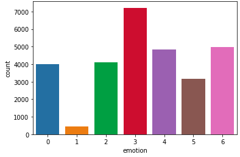

# Emotion Based Music Player
 In a world where we all are so much surrounded by machines, wouldn't it be great if we could have a software that could read our emotions and try to perform some  task based on that.
 
 In this project I have tried to implement something similar. "Emotion Based Music Player" is a web based application which uses deep learning to identify your emotions and based on your emotions play some of your favourite songs.
 
 
 ## Data Information 
The data used for training is taken from [Fer-2013 kaggle](https://www.kaggle.com/c/challenges-in-representation-learning-facial-expression-recognition-challenge/data). The data consists of 48*48 Grayscale images. The dataset consists of seven emotion classes namely (0=Angry, 1=Disgust, 2=Fear, 3=Happy, 4=Sad, 5=Surprise, 6=Neutral). The training set consists of total 28709 images. The distribution of the classes can be seen in the below image.

## Training 
The model was trained using a simple convolution network. To avoid overfitting a simple Network was chosen and the network can be found at .

## Evaluation
After training the model we received a train accuracy of a 85% and validation accuracy of 61%. The model was trained for 50 epochs.The below graph shows how train and validation accuracy varied during training.
